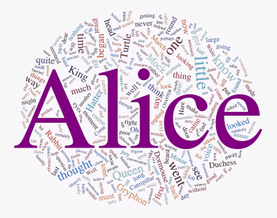
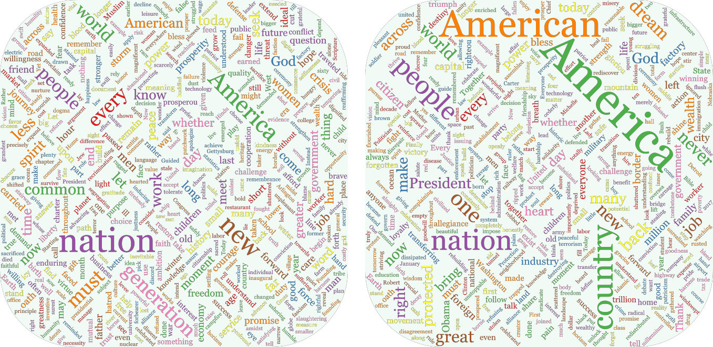

# WordCloud
wordcloud in Julia  
* **Flexible** Any mask, any color, any angle, adjustable filling rate. You can specify the initial position of some words. Or you can pin some words and adjust others, etc.
* **Fast**  100% in Julia and efficient implementation based on Quadtree & gradient optimization. The advantage is more obvious when generating large images.
* **Exact**  Words with the same weight have the exact same size. The algorithm will never scale the word to fit the blank.

---
# Installation
```julia
import Pkg; Pkg.add("WordCloud")
```
# Basic Usage 
```julia
using WordCloud
words = "天地玄黄宇宙洪荒日月盈昃辰宿列张寒来暑往秋收冬藏闰余成岁律吕调阳云腾致雨露结为霜金生丽水玉出昆冈剑号巨阙珠称夜光果珍李柰菜重芥姜海咸河淡鳞潜羽翔龙师火帝鸟官人皇始制文字乃服衣裳推位让国有虞陶唐吊民伐罪周发殷汤坐朝问道垂拱平章"
words = [string(c) for c in words]
weights = rand(length(words)) .^ 2 .* 100 .+ 30
wc = wordcloud(words, weights)
generate!(wc)
paint(wc, "qianziwen.png")
```
*Run the command `runexample(:qianziwen)` or `showexample(:qianziwen)` to get the result.*  
# More Complex Usage
```julia
using WordCloud
wc = wordcloud(
    processtext(open(pkgdir(WordCloud)*"/res/alice.txt"), stopwords=WordCloud.stopwords_en ∪ ["said"]), 
    mask = loadmask(pkgdir(WordCloud)*"/res/alice_mask.png", color="#faeef8"),
    colors = :Set1_5,
    angles = (0, 90),
    fillingrate = 0.7) |> generate!
paint(wc, "alice.png", ratio=0.5, background=outline(wc.mask, color="purple", linewidth=1))
```
*Run the command `runexample(:alice)` or `showexample(:alice)` to get the result.*  


# More Examples
## Training animation
  
[Training animation](./examples/animation.jl)  
*Run the command `runexample(:animation)` or `showexample(:animation)` to get the result.* 
## Specifies the style of a particular word
  
[Specifies the style of a particular word](./examples/specifiedstyle.jl)  
*Run the command `runexample(:specifiedstyle)` or `showexample(:specifiedstyle)` to get the result.* 
## Comparison
  
[Comparison of Obama's and Trump's inaugural address](./examples/compare.jl)  
*Run the command `runexample(:compare)` or `showexample(:compare)` to get the result.*  

***
* [x] 排序 & 预放置
* [x] 基于四叉树碰撞检测
* [x] 根据局部灰度梯度位置调整（训练迭代）
* [x] 引入动量加速训练
* [x] 分代调整以优化性能
* [x] 定位树批量碰撞检测（≈O(n)）
* [x] LRU优化性能
* [x] 控制字体大小和填充密度的策略
* [x] 重新放置和缩放的策略
* [x] 文字颜色和方向
* [ ] 并行计算
***
linux添加中文字体  
> mv wqy-microhei.ttc ~/.fonts  
> fc-cache -vf  

配置ffmpeg环境
> add /path/to/ffmpeg-4.2.1/lib to ENV["LD_LIBRARY_PATH"]  
> add /path/to/ffmpeg-4.2.1/bin to ENV["PATH"]  
***
# other wordcloud 
> [word_cloud](https://github.com/amueller/word_cloud)  
> [d3-cloud](https://github.com/jasondavies/d3-cloud)  
> [wordcloud](https://github.com/timdream/wordcloud)  