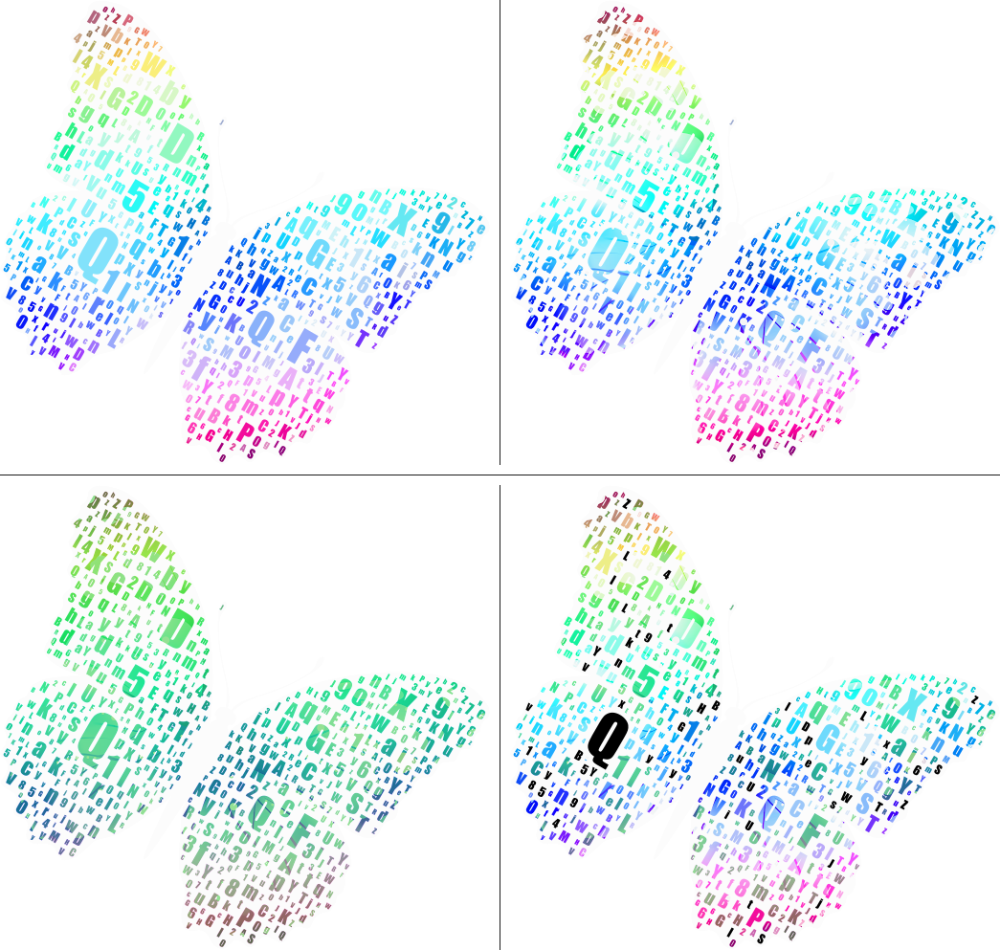

# <div><span> [WordCloud.jl](https://github.com/guo-yong-zhi/WordCloud.jl)</span></div>  
  
[](https://guo-yong-zhi.github.io/WordCloud.jl/dev) [](https://mybinder.org/v2/gh/guo-yong-zhi/WordCloud.jl/master?filepath=examples.ipynb) [](https://github.com/guo-yong-zhi/WordCloud.jl/actions/workflows/ci.yml) [](https://github.com/guo-yong-zhi/WordCloud.jl/actions/workflows/ci-nightly.yml) [](https://codecov.io/gh/guo-yong-zhi/WordCloud.jl)  
 Word cloud (tag cloud or wordle) is a novelty visual representation of text data. The importance of each word is shown with font size or color. Our generator has the following highlights:
* **Flexible** Any mask, any color, any angle, adjustable density. You can specify the initial position of some words. Or you can pin some words and adjust others, etc.
* **Fast**  100% in Julia and efficient implementation based on Quadtree & gradient optimization (see [Stuffing.jl](https://github.com/guo-yong-zhi/Stuffing.jl)). The advantage is more obvious when generating large images.
* **Exact**  Words with the same weight have the exact same size. The algorithm will never scale the word to fit the blank.  

 *run `showexample(:juliadoc)` to see how to generate the banner*
***
# Installation
```julia
import Pkg; Pkg.add("WordCloud")
```
# Basic Usage 
```julia
using WordCloud
using Random
words = [randstring(rand(1:8)) for i in 1:300]
weights = randexp(length(words))
wc1 = wordcloud(words, weights)
generate!(wc1)
paint(wc1, "random.svg")
```
Or it could be
```julia
wc2 = wordcloud("It's easy to generate word clouds") |> generate!
```
```julia
wc3 = wordcloud(open(pkgdir(WordCloud)*"/res/alice.txt")) |> generate!
```
# More Advanced Usage
```julia
using WordCloud
wc = wordcloud(
    processtext(open(pkgdir(WordCloud)*"/res/alice.txt"), stopwords=WordCloud.stopwords_en ∪ ["said"]), 
    mask = loadmask(pkgdir(WordCloud)*"/res/alice_mask.png", color="#faeef8"),
    colors = :Set1_5,
    angles = (0, 90),
    density = 0.55) |> generate!
paint(wc, "alice.png", ratio=0.5, background=outline(wc.mask, color="purple", linewidth=4))
```
*Run the command `runexample(:alice)` or `showexample(:alice)` to get the result.*  
[](./examples/alice.jl)

# More Examples
## Training animation
[](./examples/animation.jl)  
*Run the command `runexample(:animation)` or `showexample(:animation)` to get the result.* 
## Gathering style
[](./examples/gathering.jl)  
*Run the command `runexample(:gathering)` or `showexample(:gathering)` to get the result.* 
## Recolor
[](./examples/recolor.jl)  
*Run the command `runexample(:recolor)` or `showexample(:recolor)` to get the result.* 
## Semantic
[](./examples/semantic.jl)  
*Run the command `runexample(:semantic)` or `showexample(:semantic)` to get the result.*  
*The variable `WordCloud.examples` holds all available examples.* 
You can also [**see more examples**](https://github.com/guo-yong-zhi/WordCloud-Gallery) or [**try it online**](https://mybinder.org/v2/gh/guo-yong-zhi/WordCloud.jl/master?filepath=examples.ipynb).  
# Algorithm Description
Unlike most other implementations, **WordCloud.jl** is programmed based on local grayscale gradient optimization. It’s a non-greedy algorithm in which words can be further [moved](res/animation.gif) after they are positioned. This means shrinking words is unnecessary, thus the word size can be kept unchanged during the adjustment. In addition, it allows words to be assigned to any initial position whether or not there will be an overlap. This enables the program to achieve the maximum flexibility.  
**First**, raster masks of words are represented as [`AbstractStackQtree`](https://github.com/guo-yong-zhi/Stuffing.jl/blob/main/src/qtree.jl)s. The `AbstractStackQtree` forms a pyramid structure. It consists of layers of different pixel density of the original mask. Each layer is generated by reducing the pixel density of the layer below it. In this way, the `AbstractStackQtree` can be seen as a set of hierarchical bounding boxes. The value of each pixel of each layer (the node of `AbstractStackQtree`) can be `FULL`, `EMPTY` or `MIX`.  
**Second**, we use a top-down method ([`collision_randbfs`](https://github.com/guo-yong-zhi/Stuffing.jl/blob/main/src/qtreetools.jl)) to detect collision between two `AbstractStackQtree`s. On the level 𝑙 and coordinates (𝑎,𝑏), if one tree's node is `FULL` and another's is NOT `EMPTY`, then these two trees collide at (𝑙,𝑎,𝑏). However, to detect collisions between many trees/objects, pairwise detection would be time-consuming. So, we first locate the objects in hierarchical sub-areas (implemented as linked-quadtree), and then detect the collision between objects within each sub-area and between the objects in the sub-areas and those in their ancestral areas (see [`batchcollision_qtree` and `locate_core!`](https://github.com/guo-yong-zhi/Stuffing.jl/blob/main/src/qtreetools.jl)).  
**At last**, each word in collision pair is moved according to the gray gradient (calculated by [`whitesum`](https://github.com/guo-yong-zhi/Stuffing.jl/blob/main/src/train.jl)) near the collision point (𝑙,𝑎,𝑏), that is, moving the word away from `EMPTY` region. This will enlarge space between the two words. Note that, at least one of the eight pixels around the collision point is `EMPTY` or `MIX`, otherwise the collision would occur at the layer 𝑙−1. After moving the words, the `AbstractStackQtrees` should be rebuilt for the next round of collision detection.
* [x] 权重计算和单词预放置
* [x] 基于四叉树（层次包围盒）碰撞检测
* [x] 根据局部灰度梯度位置调整（训练迭代）
* [x] 引入动量加速训练
* [x] 分代检测优化性能（for pairwise trainer)
* [x] 定位树批量碰撞检测
* [x] LRU优化性能（for element-wise trainer)
* [x] 控制字体大小和填充密度的策略
* [x] 使用重新放置策略跳出局部最优
* [x] 使用缩放策略降低训练难度
* [x] 训练失败检测和提前中断
* [x] 文字颜色和方向
* [x] 并行计算
***
linux添加中文字体  
> mv wqy-microhei.ttc ~/.fonts  
> fc-cache -vf  

配置ffmpeg环境
> add /path/to/ffmpeg-4.2.1/lib to ENV["LD_LIBRARY_PATH"]  
> add /path/to/ffmpeg-4.2.1/bin to ENV["PATH"]  
***
# External Links
* [word_cloud](https://github.com/amueller/word_cloud)  
* [d3-cloud](https://github.com/jasondavies/d3-cloud)  
* [wordcloud](https://github.com/timdream/wordcloud)  
* [swcv](https://github.com/spupyrev/swcv)  
* [Wordle](http://static.mrfeinberg.com/bv_ch03.pdf)  
* [Semantic Word Clouds with Background Corpus Normalization and t-distributed Stochastic Neighbor Embedding](https://arxiv.org/pdf/1708.03569.pdf)  
* [An Evaluation of Semantically Grouped Word Cloud Designs](https://www.semanticscholar.org/paper/An-Evaluation-of-Semantically-Grouped-Word-Cloud-Hearst-Pedersen/ddae6a380123988f578433ae103393e255c0b4d1)  
